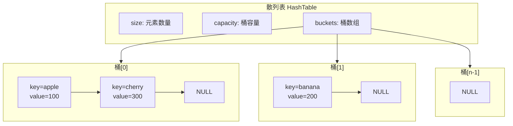
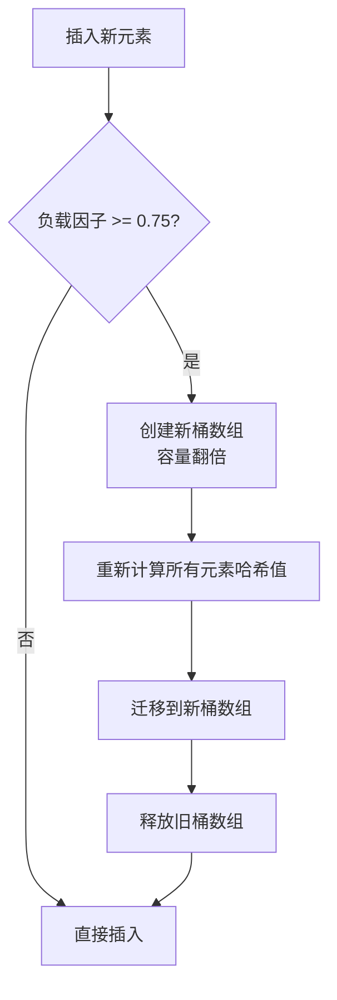

# 散列表（Hash Table）C语言实现

[](https://en.wikipedia.org/wiki/C99)
[](LICENSE)

## 项目简介

本项目是一个用C语言实现的散列表（Hash Table）数据结构，采用**链地址法（Separate Chaining）**处理哈希冲突，支持**动态扩容/缩容**，能够自动维持负载因子在合理范围内，保证操作的高效性。

## 特性

- ✅ **链地址法处理冲突** - 使用链表解决哈希碰撞
- ✅ **动态扩容** - 当负载因子 ≥ 0.75 时自动扩容
- ✅ **动态缩容** - 当负载因子 ≤ 0.125 时自动缩容
- ✅ **DJB2哈希算法** - 简单高效的字符串哈希算法
- ✅ **完整API支持** - 增删改查、遍历、状态打印等功能
- ✅ **内存安全** - 完善的内存分配检查和释放机制

## 数据结构



## 核心算法

### DJB2 哈希算法

```c
static unsigned long hashString(const char* str) {
    unsigned long hash = 5381;
    int c;
    while ((c = *str++)) {
        hash = ((hash << 5) + hash) + c; // hash * 33 + c
    }
    return hash;
}
```

### 动态扩容流程



## API 接口

| 函数                  | 功能描述        | 时间复杂度 |
| --------------------- | --------------- | ---------- |
| `hashTableCreate()`   | 创建散列表      | O(1)       |
| `hashTableDestroy()`  | 销毁散列表      | O(n)       |
| `hashTablePut()`      | 插入/更新键值对 | O(1) 均摊  |
| `hashTableGet()`      | 根据键获取值    | O(1) 平均  |
| `hashTableRemove()`   | 删除键值对      | O(1) 平均  |
| `hashTableContains()` | 检查键是否存在  | O(1) 平均  |
| `hashTableSize()`     | 获取元素数量    | O(1)       |
| `hashTableIsEmpty()`  | 判断是否为空    | O(1)       |
| `hashTableKeys()`     | 获取所有键      | O(n)       |
| `hashTablePrint()`    | 打印散列表状态  | O(n)       |

## 编译与运行

### 编译

```bash
gcc -o hash_table 散列表.cpp -std=c99
```

### 运行

```bash
./hash_table
```

## 使用示例

```c
#include <stdio.h>

int main() {
    // 创建散列表
    HashTable* ht = hashTableCreate();
    
    // 插入键值对
    hashTablePut(ht, "apple", 100);
    hashTablePut(ht, "banana", 200);
    hashTablePut(ht, "cherry", 300);
    
    // 查询值
    int value;
    if (hashTableGet(ht, "apple", &value)) {
        printf("apple = %d\n", value);  // 输出: apple = 100
    }
    
    // 检查键是否存在
    if (hashTableContains(ht, "banana")) {
        printf("banana 存在\n");
    }
    
    // 删除键值对
    hashTableRemove(ht, "banana");
    
    // 打印散列表状态
    hashTablePrint(ht);
    
    // 销毁散列表
    hashTableDestroy(ht);
    
    return 0;
}
```

## 测试输出示例

```
C:\Users\anjuxi\Desktop\C语言 散列表（Hash table）>a.exe
=== 散列表数据结构测试 ===

【基本操作测试】
插入5个键值对

=== 散列表状态 ===
元素数量: 5
桶数量: 16
负载因子: 0.31
-------------------
桶[ 0]: NULL
桶[ 1]: NULL
桶[ 2]: (cherry=300)
桶[ 3]: (date=400)
桶[ 4]: NULL
桶[ 5]: (elderberry=500)
桶[ 6]: (banana=200)
桶[ 7]: (apple=100)
桶[ 8]: NULL
桶[ 9]: NULL
桶[10]: NULL
桶[11]: NULL
桶[12]: NULL
桶[13]: NULL
桶[14]: NULL
桶[15]: NULL
===================

查询 'banana': 200
查询 'apple': 100

【更新值测试】
更新后 'apple': 150

【删除操作测试】
删除 'banana'

=== 散列表状态 ===
元素数量: 4
桶数量: 16
负载因子: 0.25
-------------------
桶[ 0]: NULL
桶[ 1]: NULL
桶[ 2]: (cherry=300)
桶[ 3]: (date=400)
桶[ 4]: NULL
桶[ 5]: (elderberry=500)
桶[ 6]: NULL
桶[ 7]: (apple=150)
桶[ 8]: NULL
桶[ 9]: NULL
桶[10]: NULL
桶[11]: NULL
桶[12]: NULL
桶[13]: NULL
桶[14]: NULL
桶[15]: NULL
===================

'banana' 是否存在: 否
【扩容测试】
插入更多元素触发扩容...

=== 散列表状态 ===
元素数量: 14
桶数量: 32
负载因子: 0.44
-------------------
桶[ 0]: (lemon=1000)
桶[ 1]: (papaya=1400) -> (orange=1300)
桶[ 2]: NULL
桶[ 3]: (date=400)
桶[ 4]: NULL
桶[ 5]: NULL
桶[ 6]: NULL
桶[ 7]: NULL
桶[ 8]: (honeydew=800)
桶[ 9]: NULL
桶[10]: (quince=1500)
桶[11]: NULL
桶[12]: NULL
桶[13]: NULL
桶[14]: NULL
桶[15]: NULL
桶[16]: NULL
桶[17]: NULL
桶[18]: (cherry=300)
桶[19]: NULL
桶[20]: (grape=700)
桶[21]: (elderberry=500)
桶[22]: NULL
桶[23]: (apple=150) -> (mango=1100)
桶[24]: NULL
桶[25]: (kiwi=900)
桶[26]: NULL
桶[27]: (fig=600)
桶[28]: NULL
桶[29]: NULL
桶[30]: (nectarine=1200)
桶[31]: NULL
===================

【遍历所有键】
所有键 (14个): lemon papaya orange date honeydew quince cherry grape elderberry apple mango kiwi fig nectarine

【冲突处理测试】
插入可能导致冲突的键...

=== 散列表状态 ===
元素数量: 17
桶数量: 32
负载因子: 0.53
-------------------
桶[ 0]: (lemon=1000)
桶[ 1]: (papaya=1400) -> (orange=1300)
桶[ 2]: NULL
桶[ 3]: (date=400)
桶[ 4]: NULL
桶[ 5]: NULL
桶[ 6]: NULL
桶[ 7]: NULL
桶[ 8]: (honeydew=800)
桶[ 9]: NULL
桶[10]: (quince=1500)
桶[11]: (bac=3) -> (cba=2) -> (abc=1)
桶[12]: NULL
桶[13]: NULL
桶[14]: NULL
桶[15]: NULL
桶[16]: NULL
桶[17]: NULL
桶[18]: (cherry=300)
桶[19]: NULL
桶[20]: (grape=700)
桶[21]: (elderberry=500)
桶[22]: NULL
桶[23]: (apple=150) -> (mango=1100)
桶[24]: NULL
桶[25]: (kiwi=900)
桶[26]: NULL
桶[27]: (fig=600)
桶[28]: NULL
桶[29]: NULL
桶[30]: (nectarine=1200)
桶[31]: NULL
===================

'abc' = 1
'cba' = 2
'bac' = 3

【查询不存在的键】
'nonexistent' 不存在（符合预期）

=== 所有测试完成 ===
```

## 技术参数

| 参数                      | 默认值 | 说明       |
| ------------------------- | ------ | ---------- |
| `INITIAL_CAPACITY`        | 16     | 初始桶数量 |
| `LOAD_FACTOR_THRESHOLD`   | 0.75   | 扩容阈值   |
| `SHRINK_FACTOR_THRESHOLD` | 0.125  | 缩容阈值   |

## 依赖

本项目仅依赖标准C库：

- `stdio.h` - 标准输入输出
- `stdlib.h` - 内存分配
- `stdbool.h` - 布尔类型支持
- `string.h` - 字符串操作

## 作者信息

**谙弆悕博士（Ailan Anjuxi）**

- 📧 邮箱：[anjuxi.ME@outlook.com](mailto:anjuxi.ME@outlook.com)
- 📞 SIP电话：[sip:anjuxi@sip.linphone.org](sip:anjuxi@sip.linphone.org)

---

*本项目用于学习和教学目的，欢迎交流与讨论！*
